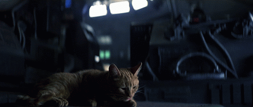

# Trabajo Práctico: Escape del Xenomorfo

  

## 👽 Introduccion

El jugador es el único sobreviviente en una estación espacial invadida por un Xenomorfo. Para escapar, debe activar manualmente los sistemas de emergencia y llegar a la zona de extracción. Pero cuidado, el alien patrulla sin cesar y, cuando sienta que vas a escapar, **te perseguirá con todo lo que tiene**.

---

## Objetivo General
Desarrollar un minijuego por consola, ambientado en el universo de *Alien*, donde un personaje (el jugador) debe escapar de una estación espacial antes de ser alcanzado por un Xenomorfo (alienígena). Para escapar, el jugador debe activar una compuerta de seguridad y luego mantener su posición en la salida durante un tiempo determinado para que esta se habilite.

---

## 🎯 Objetivos Específicos

- Representar el tablero de juego con una **matriz bidimensional**.
- Permitir al jugador moverse mediante entrada por teclado (`W`, `A`, `S`, `D`, y combinaciones diagonales).
- Implementar un **sistema de turnos iterativo** (sin recursividad).
- Dibujar el tablero actualizado en cada turno.
- Controlar al alien con distintos tipos de movimiento, incluyendo persecución.
- Definir condiciones claras de **victoria** y **derrota**.

---
## 🚪 Posiciones Iniciales

Antes de comenzar la partida, los siguientes elementos del tablero estarán ubicados en posiciones estratégicas:

- **Jugador**  
  Comienza en la mitad del borde izquierdo del tablero, listo para adentrarse en la estación.

- **Compuerta de seguridad**  
  Se encuentra ubicada en la mitad del borde derecho del tablero, siendo el objetivo principal a activar.

- **Zona de salida**  
  Está posicionada en la esquina superior izquierda del tablero, y será el punto final de escape una vez activada la compuerta.
---
## 🧠 Tipos de Movimiento del Alien (Xenomorfo)

El alien tiene **3 modos de movimiento** según la etapa del juego:

### 1. Patrullaje vertical (modo inicial)
- El alien se desplaza verticalmente (de arriba hacia abajo) a **3 casillas de distancia del lado izquierdo del tablero**.
- Invierte su dirección vertical al llegar a los extremos del tablero.

### 2. Cambio de posición por activación de compuerta
- Cuando la compuerta es activada **aparece inmediatamente a 3 casillas de distancia del lado derecho del tablero** acercandose más al jugador.
- Su movimiento vertical continúa de forma normal.

### 3. Persecución directa (modo final)
- Si el jugador está sobre la salida, con la compuerta activada, se activa una alarma y el alien entra en **modo persecución**.
  - Si el jugador está sobre la salida, con la compuerta activada, se informa que _**hace falta activar la compuerta**_
- En modo **modo persecución** el alien se mueve en dirección al jugador, avanzando 2 casillas por turno.
- Si está a 1 casilla de distancia, reduce su velocidad a 1 para no sobrepasarlo.
  - La limitacion depende del eje Fila y Columna

---

## 🏆 Condiciones de Victoria

- El jugador debe:
  1. Mantenerse **3 turnos consecutivos** sobre la **compuerta** para activarla.
  2. Luego, ir a la **salida** y permanecer **5 turnos consecutivos** sobre ella.
  3. Si cumple con esto, **la salida se activa** y el jugador **gana**.

---

## 💀 Condiciones de Derrota

- El jugador pierde si:
  - Es alcanzado por el alien (ambos en la misma casilla).
  - Se acaban los turnos disponibles (máximo de 50 turnos).

---

## ⚙️ Requisitos Técnicos

- El juego debe ejecutarse en la consola de Node.js.
   - Usar el modulo `prompt-sync` para recibir informacion desde la consola
- El tablero debe estar representado con una **matriz 2D** de **10x10**.
- El ciclo principal del juego debe ser **iterativo**, no recursivo.
- El tablero debe limpiarse y redibujarse en cada turno.
- Codigo modularizado
   - Las funciones deben estar bien organizadas y segmentadas por responsabilidades.
   - Documentacion por cada funcion

---

## 📊 Evaluación

| Criterio                                         | Puntaje |
|--------------------------------------------------|---------|
| Uso correcto de matriz bidimensional             | 1   |
| Implementación de lógica de victoria/derrota     | 1   |
| Movimiento funcional del jugador                 | 2   |
| Comportamiento de las 3 etapas del alien         | 4   |
| Código documentado y modularizado                | 2   |
| **Total**                                        | **10** |

---

## 🚀 ¡Una misión de supervivencia interestelar!

Ponte en la piel de un valiente tripulante, usa tu lógica y creatividad para programar esta experiencia de tensión y estrategia. ¡Recuerda que cada decisión cuenta y que el Xenomorfo no se detendrá hasta atraparte!

Desarrollar este juego no solo te ayuda a practicar estructuras iterativas, uso de matrices y control de flujo en JavaScript, sino que también te reta a pensar como diseñador y jugador al mismo tiempo.

**¡Atrévete a enfrentarte al alien... y escapa con tu vida y tu código intacto! 🧠👾🚨**

---

 
 
 
 
 
 
 
 
 

### Posible resultado positivo

  

### Posible resultado negativo

  

